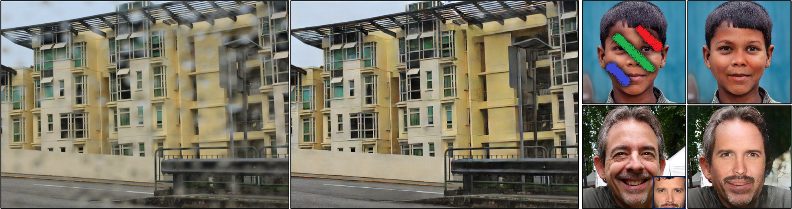

# [VCNet: a robust approach to blind image inpainting](https://arxiv.org/pdf/2003.06816.pdf)
by [Yi Wang](https://shepnerd.github.io/), [Ying-Cong Chen](https://yingcong.github.io/), [Xin Tao](), and [Jiaya Jia](http://jiaya.me/). **The code will be released soon**.

## Introduction
This repository gives the implementation of our method in ECCV 2020 paper, '[VCNet: a robust approach to blind image inpainting](https://arxiv.org/pdf/2003.06816.pdf)'. It studies how to repair images with unknown contaminations automatically.

Blind inpainting is a task to automatically complete visual contents without specifying masks for missing areas in an image. Previous work assumes *known missing-region-pattern*, limiting the application scope. We instead *relax the assumption* by defining a new blind inpainting setting, making training a neural system robust against *various unknown missing region patterns*.

## Citation

If our method is useful for your research, please consider citing:

    @article{wang2020vcnet,
        title={VCNet: A Robust Approach to Blind Image Inpainting},
        author={Wang, Yi and Chen, Ying-Cong and Tao, Xin and Jia, Jiaya},
        journal={arXiv preprint arXiv:2003.06816},
        year={2020}
    }

### Contact
Please send email to yiwang@cse.cuhk.edu.hk.
